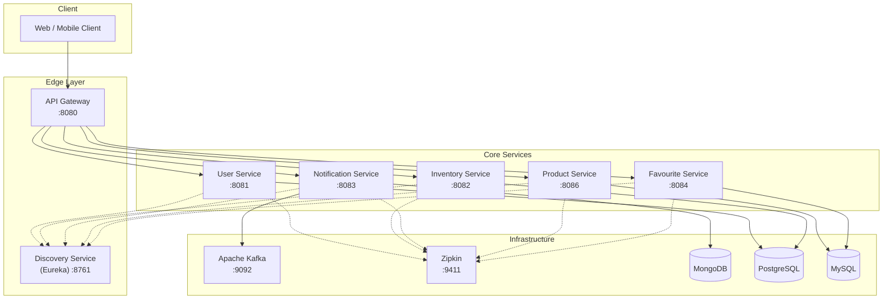

# 🛒 Ecommerce Microservices Platform

[](https://www.oracle.com/java/technologies/javase/jdk17-archive-downloads.html)
[](https://spring.io/projects/spring-boot)
[](https://spring.io/projects/spring-cloud)
[](LICENSE)

A high-performance, scalable microservices ecosystem for modern ecommerce, built with **Spring Boot 4.0.3**, **Spring Cloud**, and a decoupled Maven architecture. Designed to handle billions of products and requests per second.

---

## 🏗️ System Architecture



---

## 🛠️ Technology Stack

| Category | Technology |
|---|---|
| **Language** | Java 17 |
| **Framework** | Spring Boot 4.0.3, Spring Cloud 2025.1.0 |
| **Gateway** | Spring Cloud Gateway |
| **Discovery** | Netflix Eureka |
| **Messaging** | Apache Kafka (with Zookeeper & Kafka UI) |
| **Databases** | PostgreSQL, MySQL, MongoDB |
| **Observability** | Zipkin (Tracing), Spring Boot Actuator |
| **Documentation** | SpringDoc OpenAPI (Swagger), Markdown Docs |
| **Build Tool** | Maven (Multi-module Decoupled Architecture) |

---

## 📂 Project Structure & Documentation

This project follows a standardized documentation structure. For deep dives into architecture, design, and setup, see the [docs/](./docs) folder.

*   [**Installation & Running Guide**](./docs/installation-and-running.md) — Step-by-step setup and port mapping.
*   [**Architecture Overview**](./docs/architecture-overview.md) — High-level system design.
*   [**Service Roadmap & Scaling**](./docs/service-roadmap-and-scaling.md) — Plan for billion-scale and future services.
*   [**User Service**](./docs/user-service.md) | [**Product Service**](./docs/product-service.md) | [**Notification Service**](./docs/notification-service.md) — Low-level designs.
*   [**API Gateway**](./docs/api-gateway.md) | [**Discovery Service**](./docs/discovery-service.md) — Infrastructure docs.

---

## 📋 Prerequisites

Before you begin, ensure you have the following installed:
- **Java 17 JDK** (Standard for all services)
- **Maven 3.8+** (For building the project)
- **Docker Desktop** (For running databases, Kafka, and Zipkin)
- **Git** (To clone the repository)

---

## 🛠️ Installation & Running

### 1. Build the Project
```bash
git clone <repository-url>
cd ecommerce-microservices-learning
mvn clean install -DskipTests
```

### 2. Start Infrastructure (Docker)
```bash
docker-compose up -d
```
Starts **PostgreSQL** (5432), **MySQL** (3306), **MongoDB** (27017), **Kafka** (9092), and **Zipkin** (9411).

### 3. Launch Services (In Order)
1.  **Discovery Service** (Port `8761`)
2.  **API Gateway** (Port `8080`)
3.  **Business Services** (User, Inventory, Notification, etc.)

---

## 🏃 Running Services Individually

If a global build or run fails, or if you only need to work on a specific module, you can run each service independently:

### Step 1: Install Common Library
Before running any business service, ensure the common library is installed in your local Maven repository:
```bash
cd common-lib
mvn clean install -DskipTests
cd ..
```

### Step 2: Run Microservices
Navigate to the service directory and use the Spring Boot Maven plugin:

```bash
# Order 1: Discovery (Wait for it to be UP)
cd discovery-service
mvn spring-boot:run

# Order 2: API Gateway
cd api-gateway
mvn spring-boot:run

# Order 3: Any Business Service (User, Product, etc.)
cd user-service
mvn spring-boot:run
```

*Tip: Use `mvn spring-boot:run -Dspring-boot.run.arguments="--server.port=XXXX"` to override ports on the fly.*

---

## 📦 Microservices Registry & Ports

| Service | Port | Database | Swagger UI Entry Point |
|---|---|---|---|
| **Discovery Service** | `8761` | — | [http://localhost:8761](http://localhost:8761) |
| **API Gateway** | `8080` | — | **Main Entry Point** |
| **User Service** | `8081` | PostgreSQL | [http://localhost:8081/swagger-ui/index.html](http://localhost:8081/swagger-ui/index.html) |
| **Inventory Service** | `8082` | PostgreSQL | [http://localhost:8082/swagger-ui/index.html](http://localhost:8082/swagger-ui/index.html) |
| **Notification Service**| `8083` | MongoDB | [http://localhost:8083/swagger-ui/index.html](http://localhost:8083/swagger-ui/index.html) |
| **Favourite Service** | `8084` | MySQL | [http://localhost:8084/swagger-ui.html](http://localhost:8084/swagger-ui.html) |
| **Product Service** | `8086` | MySQL | [http://localhost:8086/swagger-ui.html](http://localhost:8086/swagger-ui.html) |

---

## 🔗 Main Entry Point (API Gateway)

The **API Gateway (8080)** routes all external traffic:
- **Auth**: `http://localhost:8080/api/auth/**`
- **Products**: `http://localhost:8080/api/products/**`
- **Inventory**: `http://localhost:8080/api/inventory/**`
- **Notifications**: `http://localhost:8080/api/email/**`

---

## 🔍 Monitoring & Debugging

- **Eureka Dashboard:** [http://localhost:8761](http://localhost:8761)
- **Zipkin Tracing:** [http://localhost:9411](http://localhost:9411)
- **Kafka UI:** [http://localhost:8085](http://localhost:8085)


---

## 🛡️ Decoupled Architecture Note
This project uses a **Decoupled Maven Architecture**. The root POM handles project aggregation and global build policies, while each microservice is responsible for its own dependency versions. This allows for independent service evolution and easier scaling.

---

## 👨‍💻 Roadmap
Check the [Service Roadmap](./docs/service-roadmap-and-scaling.md) for upcoming features including:
- [ ] Order & Payment Services
- [ ] Elasticsearch Integration for Search
- [ ] Kubernetes (EKS) Deployment Manifests
- [ ] Redis Cluster for High-Speed Caching

---
*Built with ❤️ for Microservices Learning.*