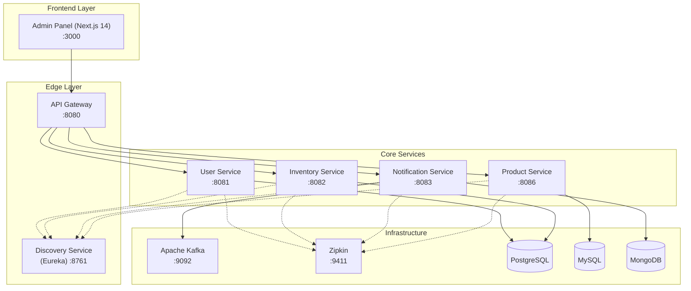

# 🛒 Ecommerce Microservices Platform

[](https://www.oracle.com/java/technologies/javase/jdk17-archive-downloads.html)
[](https://spring.io/projects/spring-boot)
[](https://spring.io/projects/spring-cloud)
[](https://nextjs.org/)
[](LICENSE)

A high-performance, scalable microservices ecosystem for modern ecommerce, built with **Spring Boot 3.3.5**, **Spring Cloud**, and a **Next.js 14** admin panel. Designed to handle billion-scale products and requests with a premium, WooCommerce-inspired management interface.

---

## 🏗️ System Architecture



---

## 🛠️ Technology Stack

| Category | Technology |
|---|---|
| **Frontend** | Next.js 14, Tailwind CSS, Lucide Icons, Redux Toolkit |
| **Backend** | Java 17, Spring Boot 3.3.5, Spring Cloud |
| **Gateway** | Spring Cloud Gateway (Port 8080) |
| **Discovery** | Netflix Eureka (Port 8761) |
| **Messaging** | Apache Kafka |
| **Databases** | PostgreSQL (User/Inventory), MySQL (Product), MongoDB (Notifications) |
| **Observability** | Zipkin, Spring Boot Actuator |

---

## 📂 Project Structure

- `frontend/`: Next.js 14 application (Admin Panel).
- `api-gateway/`: Centralized entry point for all microservices.
- `discovery-service/`: Eureka Server for service registration.
- `common-lib/`: Shared security, logging, and DTO configurations.
- `product-service/`: Manages products, categories, and inventory logic.
- `user-service/`: Handles authentication, roles, and user profiles.
- `notification-service/`: Event-driven email/SMS notifications.

---

## 🚀 Getting Started

### 1. Prerequisites
- **Java 17 JDK**
- **Node.js 18+**
- **Docker Desktop**
- **Maven 3.8+**

### 2. Infrastructure Setup
```bash
docker-compose up -d
```

### 3. Backend Setup
```bash
# Install common-lib first
cd common-lib
mvn clean install -DskipTests

# Run Discovery & Gateway
cd ../discovery-service && mvn spring-boot:run
cd ../api-gateway && mvn spring-boot:run

# Run Core Services
cd ../product-service && mvn spring-boot:run
cd ../user-service && mvn spring-boot:run
```

### 4. Frontend Setup
```bash
cd frontend
npm install
npm run dev
```
Open [http://localhost:3000](http://localhost:3000) to access the WooCommerce-style admin panel.

---

## 🛡️ Key Features
- **Centralized Security**: JWT-based authentication via `common-lib`.
- **WooCommerce Admin UX**: Premium dashboard with real-time stats and management tools.
- **Event-Driven**: Kafka integration for asynchronous tasks like notifications.
- **Dynamic Routing**: Automatic service discovery and load balancing via Eureka.

---
*Built with ❤️ for Microservices Learning.*