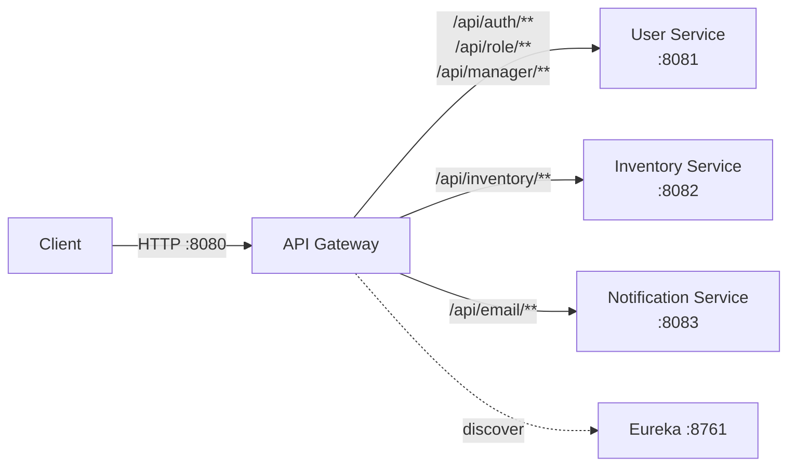
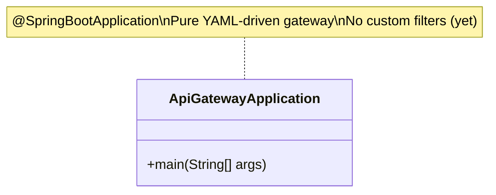
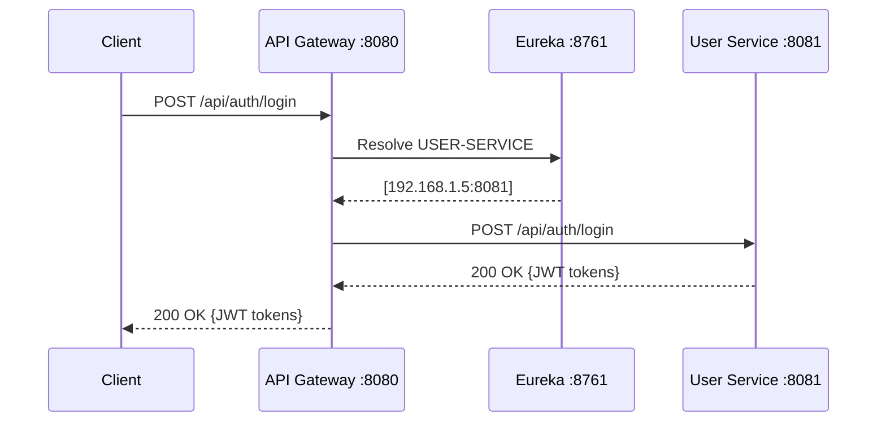

# API Gateway Documentation

## Overview
The API Gateway is the **single entry point** for all client requests. Built on **Spring Cloud Gateway**, it routes incoming HTTP requests to the appropriate downstream microservice using Eureka-based service discovery and client-side load balancing.

**Port:** `8080` &nbsp;|&nbsp; **Eureka Name:** `API-GATEWAY`

---

## Features

| Feature | Status | Description |
|---|---|---|
| Dynamic Routing | ✅ | Routes to services via `lb://SERVICE-NAME` |
| Service Discovery | ✅ | Integrates with Eureka for automatic resolution |
| Load Balancing | ✅ | Client-side load balancing via Spring Cloud LoadBalancer |
| Path-based Routing | ✅ | Routes based on URL path predicates |
| Centralized Logging | ✅ | TRACE-level gateway logs, DEBUG-level Netty logs |

---

## High-Level Design

---

## Low-Level Design

### Route Configuration

| Route ID | Path Predicate | Target Service | Load Balanced |
|---|---|---|---|
| `user-service-auth` | `/api/auth/**` | `lb://USER-SERVICE` | ✅ |
| `user-service-information` | `/api/role/**` | `lb://USER-SERVICE` | ✅ |
| `user-service-manager` | `/api/manager/**` | `lb://USER-SERVICE` | ✅ |
| `inventory-service` | `/api/inventory/**` | `lb://INVENTORY-SERVICE` | ✅ |
| `notification-service-notifications` | `/api/email/**` | `lb://NOTIFICATION-SERVICE` | ✅ |

### Class Diagram

### Configuration Highlights
- **Discovery Locator enabled** — Auto-creates routes for all Eureka-registered services
- **`lower-case-service-id: true`** — Normalizes service IDs to lowercase in auto-routes

---

## Flow: Request Routing

