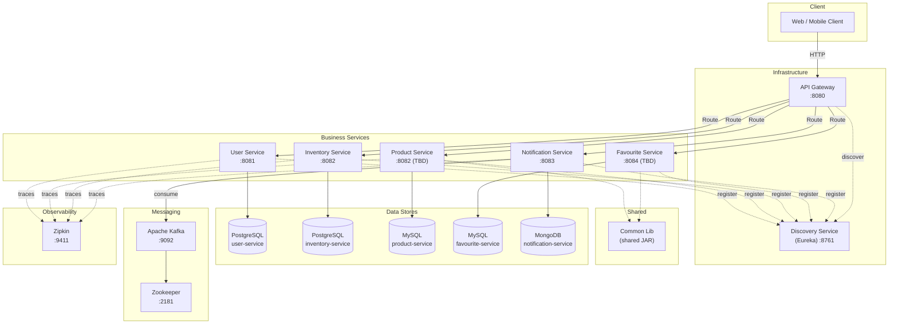

# Ecommerce Microservices — Architecture Overview

## High-Level System Design



## Service Registry

| Service | Port | Database | Eureka Name |
|---|---|---|---|
| Discovery Service | 8761 | — | DISCOVERY-SERVICE |
| API Gateway | 8080 | — | API-GATEWAY |
| User Service | 8081 | PostgreSQL | USER-SERVICE |
| Inventory Service | 8082 | PostgreSQL | INVENTORY-SERVICE |
| Notification Service | 8083 | MongoDB | NOTIFICATION-SERVICE |
| Product Service | TBD | MySQL | PRODUCT-SERVICE |
| Favourite Service | TBD | MySQL | FAVOURITE-SERVICE |

## Technology Stack

| Layer | Technology |
|---|---|
| Language | Java 17 |
| Framework | Spring Boot 4.0.3 |
| Cloud | Spring Cloud 2025.1.0 |
| Service Discovery | Netflix Eureka |
| API Gateway | Spring Cloud Gateway |
| Security | Spring Security + JWT (HS512) |
| ORM | Spring Data JPA / Hibernate |
| Databases | PostgreSQL, MySQL, MongoDB |
| Messaging | Apache Kafka |
| Tracing | Zipkin + Sleuth |
| Docs | SpringDoc OpenAPI (Swagger) |
| Build | Maven (multi-module) |
| Containerization | Docker + Docker Compose |

## Communication Patterns

| Pattern | Usage |
|---|---|
| Synchronous (REST) | Client → Gateway → Service |
| Service Discovery | Eureka-based `lb://SERVICE-NAME` routing |
| Async Messaging | Kafka for payment/order event notifications |
| Reactive | WebFlux `Mono`/`Flux` wrappers for non-blocking I/O |

## Package Convention

All services follow the package naming standard:
```
com.ecommerce.<service_name>
```

Examples:
- `com.ecommerce.user_service`
- `com.ecommerce.product_service`
- `com.ecommerce.common_lib`
