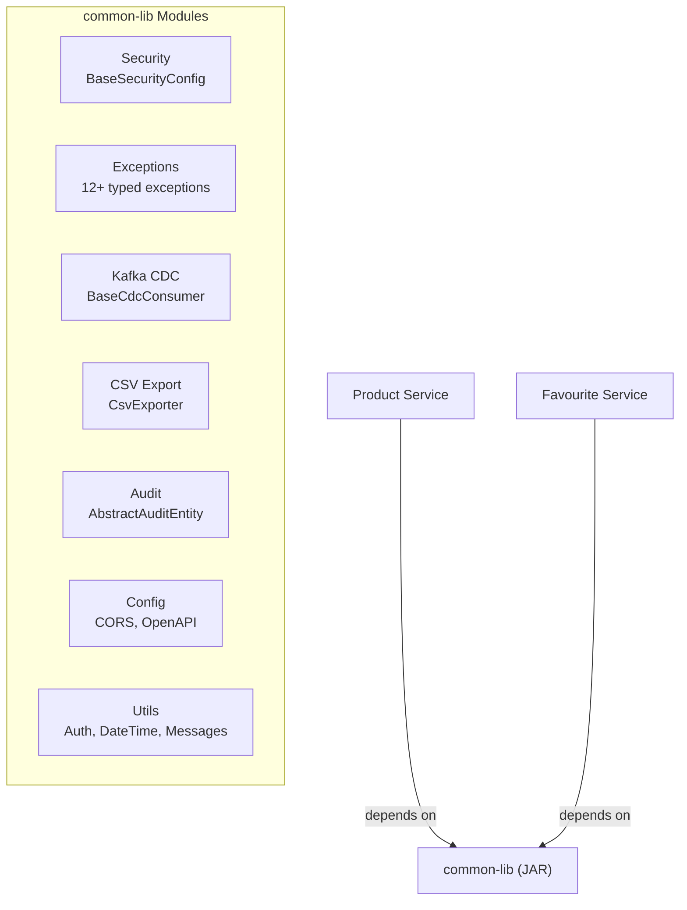

# Common Library Documentation

## Overview
The Common Library (`common-lib`) is a **shared JAR module** providing reusable components across all microservices — including security configs, exception handling, Kafka CDC utilities, CSV export, audit entities, and OpenAPI configuration.

**Packaging:** JAR (not a runnable service) | **Used by:** product-service, favourite-service

---

## Features

| Feature | Description |
|---|---|
| **BaseSecurityConfig** | Shared OAuth2 Resource Server + JWT decoder |
| **CorsConfig** | Configurable CORS via `cors.allowed-origins` |
| **OpenApiConfig** | Centralized Swagger/OpenAPI setup with JWT bearer auth |
| **Exception Framework** | 12+ typed exceptions + global `@ControllerAdvice` handler |
| **Kafka CDC** | Base consumer, retry/DLQ support, product CDC messages |
| **CSV Export** | Annotation-driven CSV generation (`@CsvColumn`, `@CsvName`) |
| **Audit Entity** | `AbstractAuditEntity` with `createdBy`, `createdDate`, `lastModifiedBy`, `lastModifiedDate` |
| **Utilities** | `AuthenticationUtils`, `DateTimeUtils`, `MessagesUtils` |
| **BaseMapper** | MapStruct base mapper interface |

---

## High-Level Design



## Low-Level Design

### Package Structure

```
com.ecommerce.common_lib/
├── config/
│   ├── CorsConfig.java
│   ├── OpenApiConfig.java
│   └── ServiceUrlConfig.java
├── constants/
│   ├── ApiConstant.java
│   ├── MessageCode.java
│   └── PageableConstant.java
├── csv/
│   ├── BaseCsv.java
│   ├── CsvExporter.java
│   └── anotation/ (CsvColumn, CsvName)
├── exception/
│   ├── ApiExceptionHandler.java
│   └── 12 exception classes
├── kafka/cdc/
│   ├── BaseCdcConsumer.java
│   ├── RetrySupportDql.java
│   ├── config/BaseKafkaListenerConfig.java
│   └── message/ (Operation, Product, ProductCdcMessage, ProductMsgKey)
├── mapper/
│   ├── BaseMapper.java
│   └── EntityCreateUpdateMapper.java
├── model/
│   ├── AbstractAuditEntity.java
│   └── listener/CustomAuditingEntityListener.java
├── security/
│   └── BaseSecurityConfig.java
├── utils/
│   ├── AuthenticationUtils.java
│   ├── DateTimeUtils.java
│   └── MessagesUtils.java
└── viewmodel/error/
    └── ErrorVm.java
```

### Exception Hierarchy

| Exception | HTTP Status |
|---|---|
| `NotFoundException` | 404 |
| `BadRequestException` | 400 |
| `AccessDeniedException` | 403 |
| `ForbiddenException` | 403 |
| `DuplicatedException` | 409 |
| `InternalServerErrorException` | 500 |
| `SignInRequiredException` | 401 |
| `UnsupportedMediaTypeException` | 415 |
| `WrongEmailFormatException` | 400 |
| `StockExistingException` | 409 |
| `MultipartFileContentException` | 400 |
| `CreateGuestUserException` | 500 |
