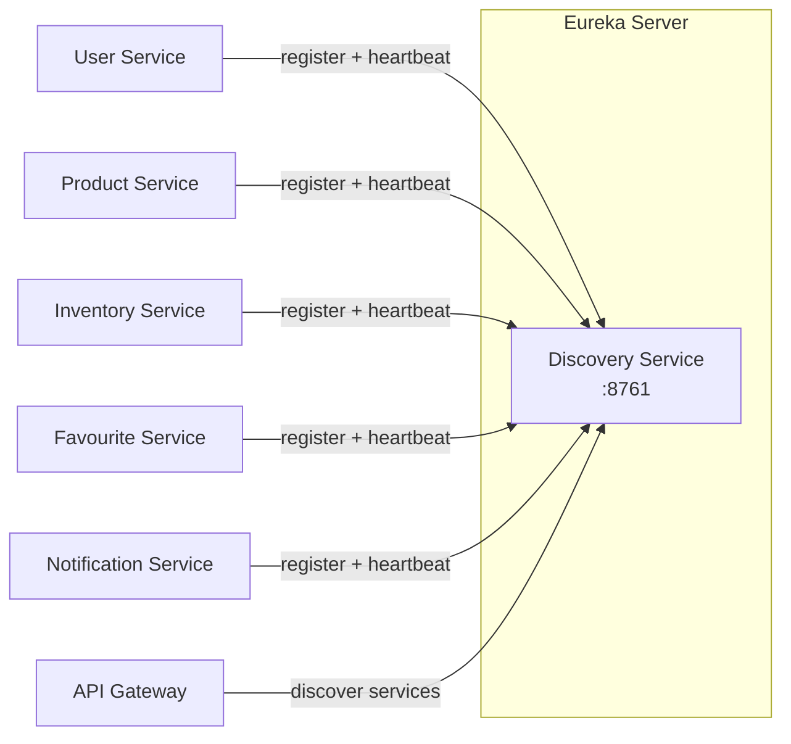
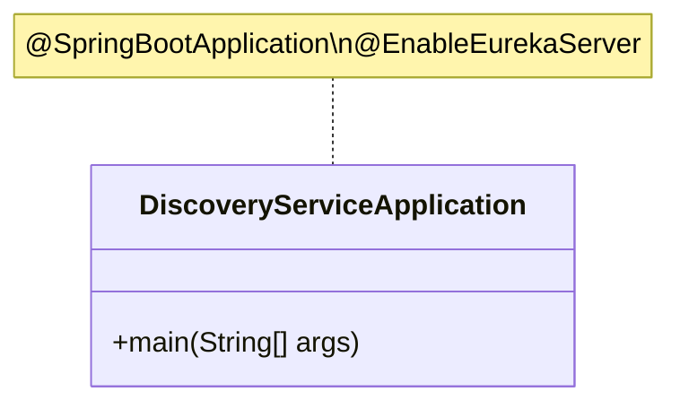
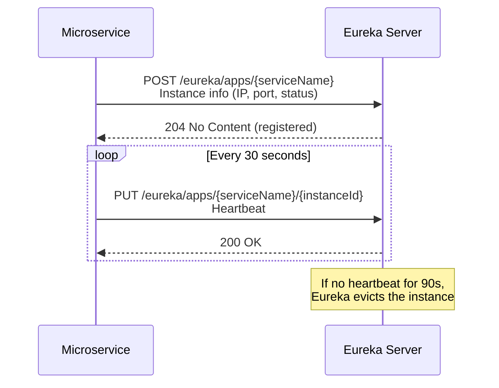

# Discovery Service Documentation

## Overview
The Discovery Service is a **Netflix Eureka Server** that acts as the central service registry for the entire microservices ecosystem. All services register themselves here and discover each other through it.

**Port:** `8761` &nbsp;|&nbsp; **Eureka Name:** `DISCOVERY-SERVICE`

---

## Features

| Feature | Status | Description |
|---|---|---|
| Service Registration | ✅ | Accepts heartbeats from all microservices |
| Service Discovery | ✅ | Returns registry of healthy service instances |
| Health Dashboard | ✅ | Built-in Eureka web dashboard at `:8761` |
| Self-preservation | ✅ | Default Eureka self-preservation mode |

---

## High-Level Design



### How It Works
1. Each microservice on startup sends a **registration request** to Eureka
2. Eureka stores the service name → instance IP:port mapping
3. Services send periodic **heartbeats** (default: every 30s) to stay registered
4. API Gateway queries Eureka to resolve `lb://SERVICE-NAME` to actual addresses
5. If a service stops sending heartbeats, Eureka evicts it after the lease expires

---

## Low-Level Design

### Class Diagram



### Configuration

```yaml
server:
  port: 8761

eureka:
  instance:
    hostname: localhost
  client:
    register-with-eureka: false   # Server doesn't register with itself
    fetch-registry: false          # Server doesn't need to fetch registry
    serviceUrl:
      defaultZone: http://localhost:8761/eureka
```

### Key Design Decisions
- **`register-with-eureka: false`** — The Eureka server itself doesn't register as a client
- **`fetch-registry: false`** — No need to fetch registry since this IS the registry
- **GMT +0:00 timezone** — Set at startup for consistent timestamp handling

---

## Flow: Service Registration


