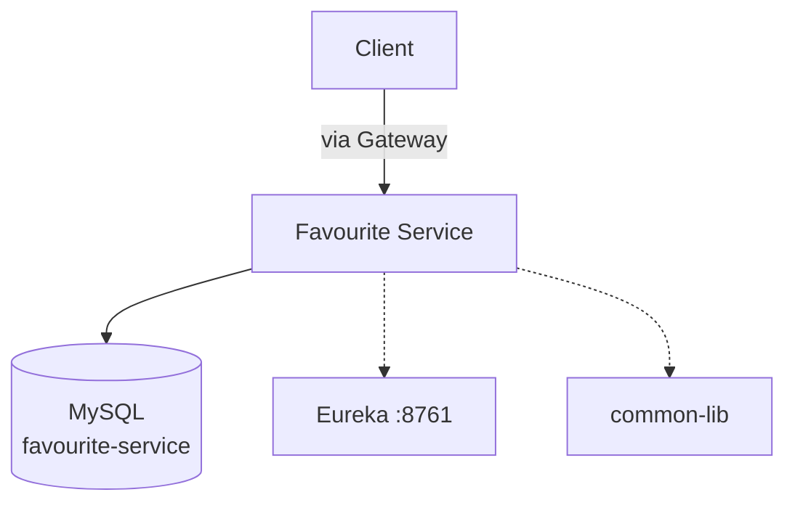
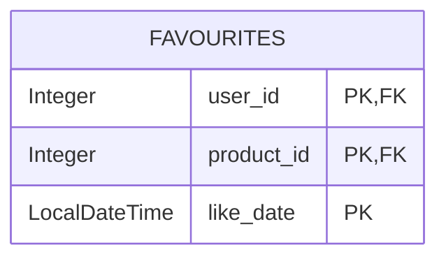
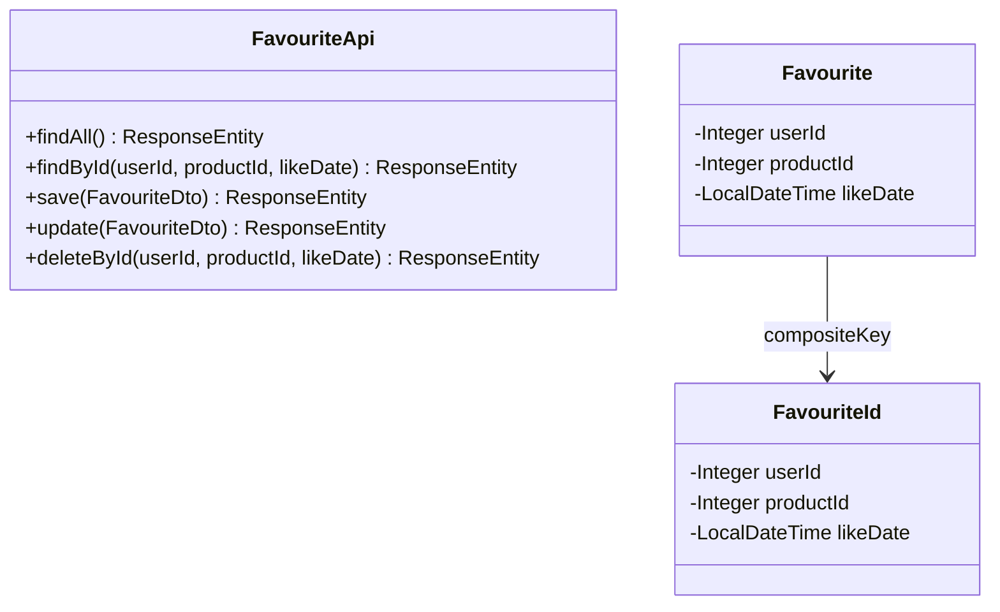
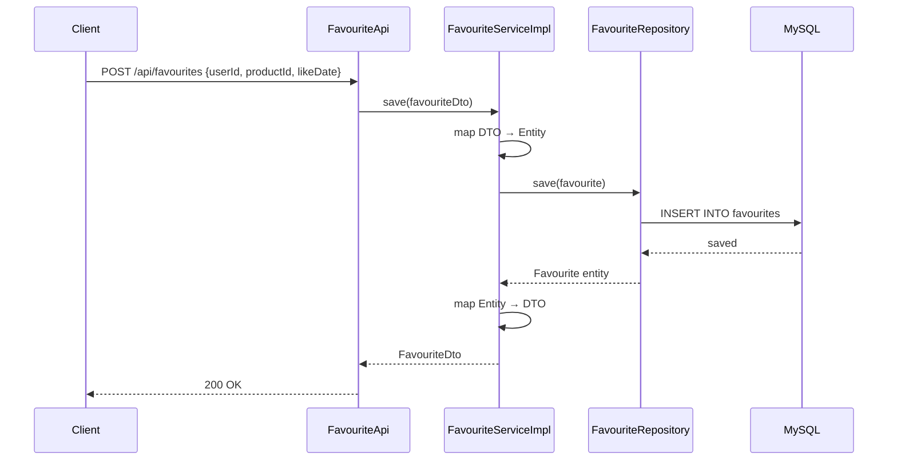

# Favourite Service Documentation

## Overview
The Favourite Service manages **user wishlists/favourites** — allowing users to like/unlike products. It uses a **composite primary key** (userId + productId + likeDate) to track each favourite action.

**Port:** TBD | **Database:** MySQL | **Eureka Name:** `FAVOURITE-SERVICE`

---

## Features

| Feature | Status | Description |
|---|---|---|
| List All Favourites | ✅ | Returns all favourite records |
| Get Favourite by ID | ✅ | Composite key lookup (userId + productId + likeDate) |
| Add Favourite | ✅ | Create new favourite entry |
| Update Favourite | ✅ | Modify existing favourite |
| Delete Favourite | ✅ | Remove by composite key (path or body) |
| Distributed Tracing | ✅ | Zipkin + Micrometer Brave |
| Eureka Registration | ✅ | Registers via `@EnableEurekaClient` |

---

## High-Level Design

## Low-Level Design

### Entity Model

### Class Diagram

### API Endpoints

| Method | Path | Description |
|---|---|---|
| `GET` | `/api/favourites` | List all favourites |
| `GET` | `/api/favourites/{userId}/{productId}/{likeDate}` | Get by composite key |
| `GET` | `/api/favourites/find` | Get by composite key (body) |
| `POST` | `/api/favourites` | Add favourite |
| `PUT` | `/api/favourites` | Update favourite |
| `DELETE` | `/api/favourites/{userId}/{productId}/{likeDate}` | Remove by path |
| `DELETE` | `/api/favourites/delete` | Remove by body |

### Flow: Add to Favourites

