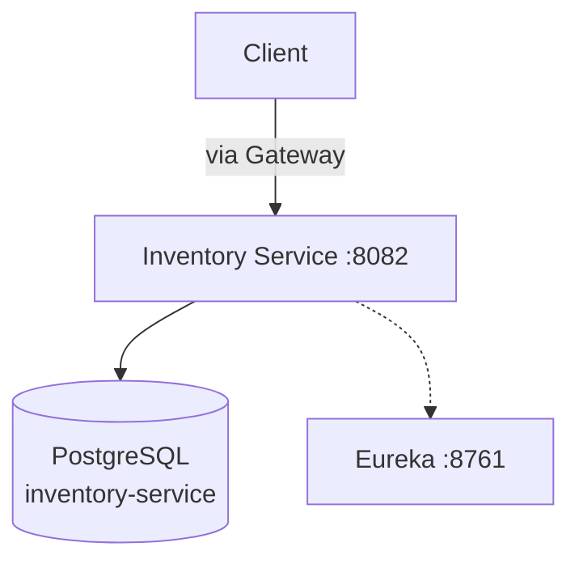
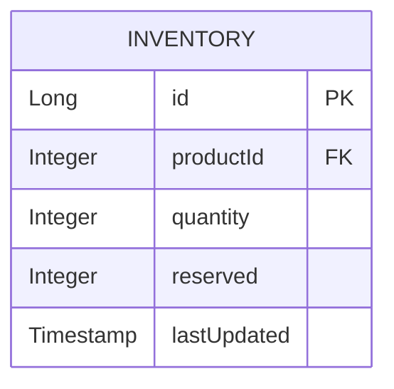

# Inventory Service Documentation

## Overview
The Inventory Service manages **stock levels and product availability**. Currently in **scaffold phase** — the app skeleton, DB connection, security, and Eureka registration are configured.

**Port:** `8082` | **Database:** PostgreSQL | **Eureka Name:** `INVENTORY-SERVICE`

---

## Features

| Feature | Status | Description |
|---|---|---|
| Application Skeleton | ✅ | Spring Boot with JPA, Security, Actuator |
| PostgreSQL Connection | ✅ | `ddl-auto: update` |
| Eureka Registration | ✅ | Registers as `INVENTORY-SERVICE` |
| JWT Configuration | ✅ | Shared JWT secret configured |
| Actuator | ✅ | Health checks at `/actuator/**` |
| Swagger UI | ✅ | OpenAPI at `/swagger-ui/index.html` |
| Stock CRUD | ⬜ | Not yet implemented |
| Reserve/Release Stock | ⬜ | Not yet implemented |

---

## High-Level Design

## Low-Level Design

### Planned Entity

### Configuration
- **Database:** PostgreSQL at `localhost:5432/inventory-service`
- **JWT:** Shares secret key with User Service
- **Tracing:** Zipkin at `localhost:9411`
