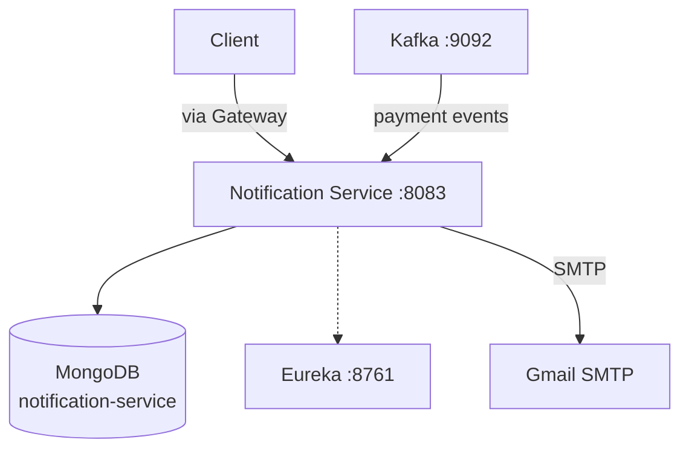
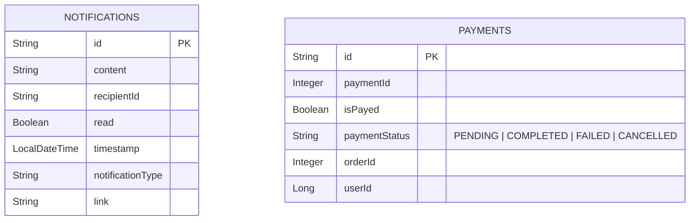
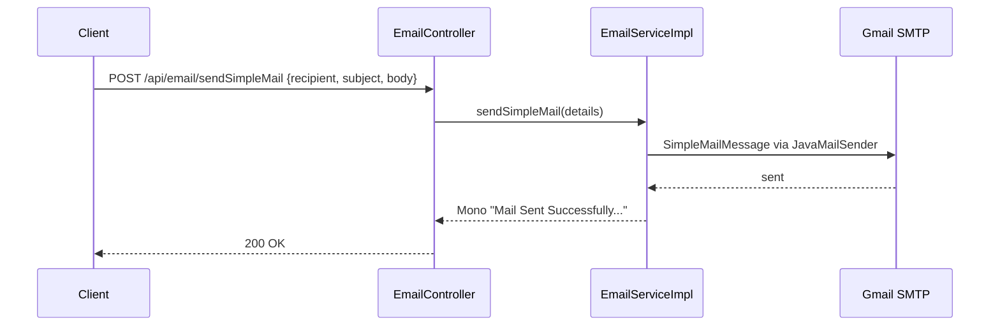

# Notification Service Documentation

## Overview
The Notification Service handles **email sending, in-app notifications, and payment event consumption** via Kafka. It uses **MongoDB** for persistence and supports both simple and attachment-based emails.

**Port:** `8083` | **Database:** MongoDB | **Eureka Name:** `NOTIFICATION-SERVICE`

---

## Features

| Feature | Status | Description |
|---|---|---|
| Send Simple Email | ✅ | Plain text email via SMTP |
| Send Email with Attachment | ✅ | File attachment support |
| Send Email with MultipartFile | ✅ | Upload-based attachments with CC |
| CRUD Notifications | ✅ | Create, read, delete in-app notifications |
| Kafka Consumer | ✅ | Payment event consumption configured |
| MongoDB Persistence | ✅ | Notifications + Payments stored |
| Eureka Registration | ✅ | Registers as `NOTIFICATION-SERVICE` |
| Reactive Email Sending | ✅ | `Mono`-based non-blocking email ops |

---

## High-Level Design

## Low-Level Design

### Entity Model

### API Endpoints

| Method | Path | Description |
|---|---|---|
| `POST` | `/api/email/sendSimpleMail` | Send plain text email |
| `POST` | `/api/email/sendMailWithAttachment` | Send email with file path attachment |
| `POST` | `/api/email/sendMail` | Send email with uploaded files + CC |
| `GET` | `/api/notification` | List all notifications |
| `GET` | `/api/notification/{id}` | Get notification by ID |
| `POST` | `/api/notification` | Create notification |
| `DELETE` | `/api/notification/{id}` | Delete notification |

### Flow: Send Email

