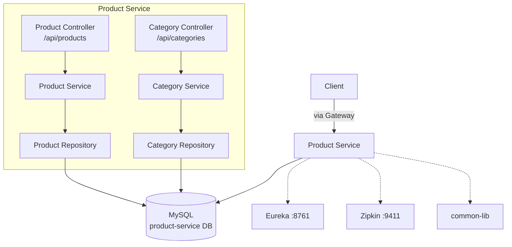
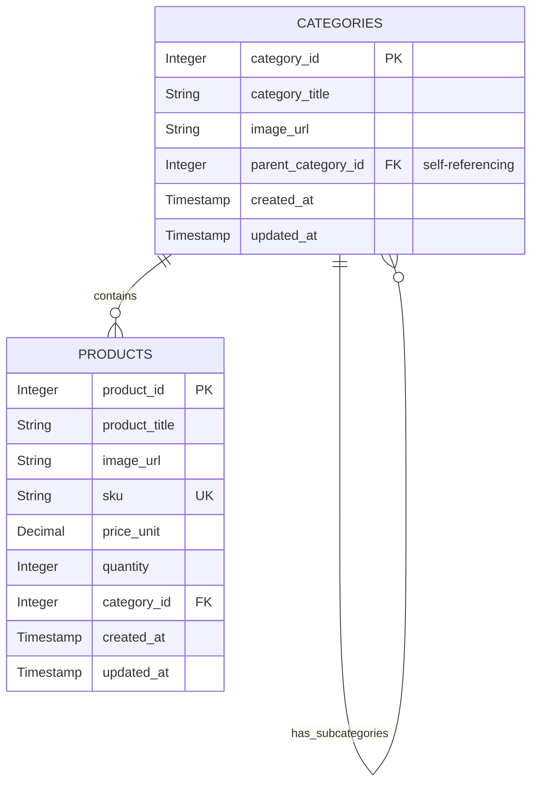
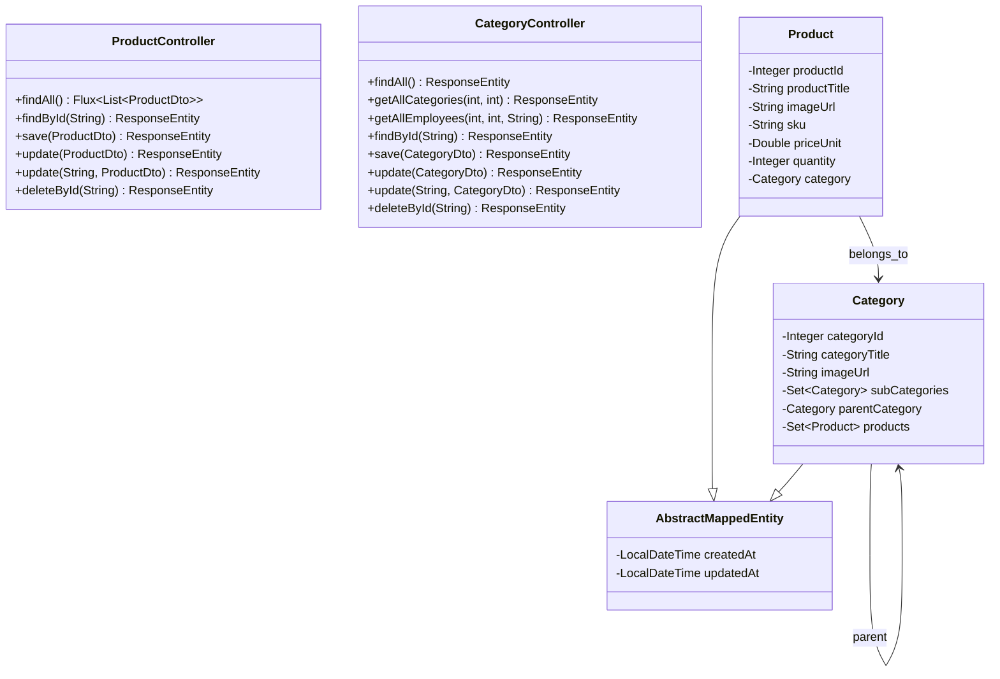
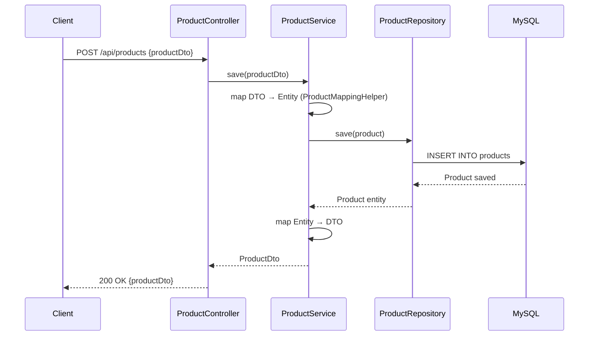
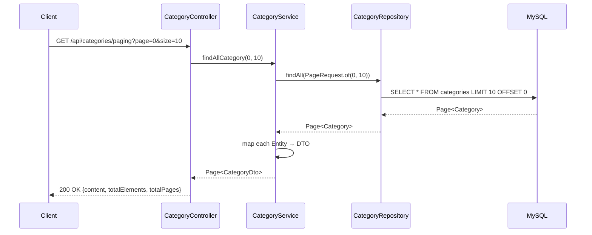

# Product Service Documentation

## Overview
The Product Service manages the **product catalog and categories** for the ecommerce platform. It supports full CRUD operations on products and categories, including hierarchical (nested) categories with pagination and sorting.

**Port:** TBD &nbsp;|&nbsp; **Database:** MySQL &nbsp;|&nbsp; **Eureka Name:** `PRODUCT-SERVICE`

---

## Features

| Feature | Status | Description |
|---|---|---|
| List All Products | ✅ | Reactive `Flux` returning all products |
| Get Product by ID | ✅ | Fetch single product by ID |
| Create Product | ✅ | Create with validation |
| Update Product | ✅ | Update by ID or full entity |
| Delete Product | ✅ | Delete by ID |
| List All Categories | ✅ | Reactive `Flux` returning all categories |
| Get Category by ID | ✅ | Fetch single category |
| Create Category | ✅ | Create with reactive `Mono` return |
| Update Category | ✅ | Update by ID or full entity |
| Delete Category | ✅ | Delete by ID |
| Category Pagination | ✅ | Paged results with `Page<CategoryDto>` |
| Category Sorting | ✅ | Paging + sorting via query params |
| Nested Categories | ✅ | Self-referencing parent/child hierarchy |
| Distributed Tracing | ✅ | Zipkin + Micrometer Brave |

---

## High-Level Design

---

## Low-Level Design

### Entity Relationship

### Class Diagram

### API Endpoints

| Method | Path | Description |
|---|---|---|
| `GET` | `/api/products` | List all products |
| `GET` | `/api/products/{id}` | Get product by ID |
| `POST` | `/api/products` | Create product |
| `PUT` | `/api/products` | Update product (full) |
| `PUT` | `/api/products/{id}` | Update product by ID |
| `DELETE` | `/api/products/{id}` | Delete product |
| `GET` | `/api/categories` | List all categories |
| `GET` | `/api/categories/{id}` | Get category by ID |
| `GET` | `/api/categories/paging` | Paginated categories |
| `GET` | `/api/categories/paging-and-sorting` | Paginated + sorted |
| `POST` | `/api/categories` | Create category |
| `PUT` | `/api/categories` | Update category (full) |
| `PUT` | `/api/categories/{id}` | Update category by ID |
| `DELETE` | `/api/categories/{id}` | Delete category |

---

## Flows

### Flow: Create Product

### Flow: Get Paginated Categories

