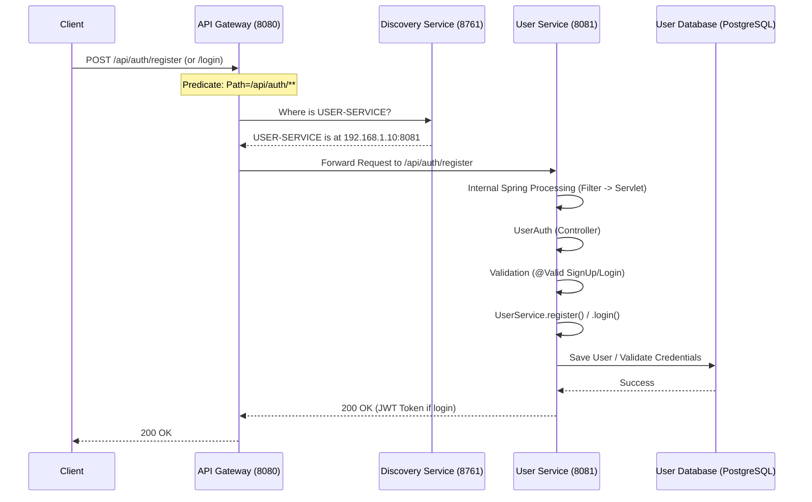
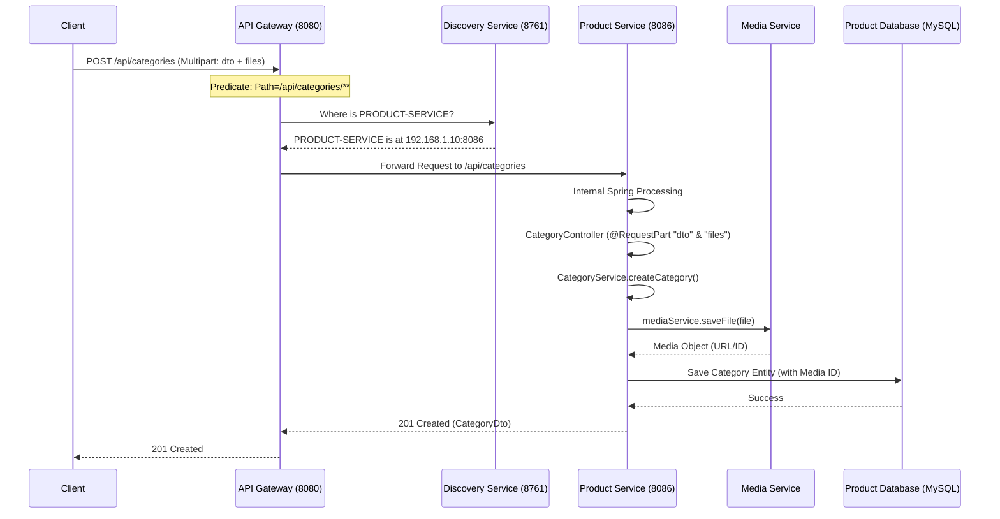

# Microservices Request Flow Documentation

This document explains how requests travel through the microservices architecture, specifically focusing on the **User Service** (Authentication) and **Product Service** (Category Management). It also details the internal Spring Boot request processing lifecycle.

## 🏢 Architecture Overview

1.  **API Gateway (Port 8080):** The entry point for all client requests. Handles routing, security, and rate limiting.
2.  **Discovery Service (Eureka - Port 8761):** Maintains a registry of all running microservices.
3.  **Microservices:** Individual services like `User-Service` and `Product-Service`.

---

## 🔐 1. User Service: Registration & Login Flow

When a user tries to Register or Login, the request follows this path:

### Sequence Diagram


### Key Classes Involved:
*   **API Gateway:** Routes based on `Path=/api/auth/**` to `lb://USER-SERVICE`.
*   **Controller:** `UserAuth.java` (Endpoints: `/signup`, `/signin`).
*   **Service:** `UserServiceImpl.java` (Logic for hashing passwords, generating JWT).
*   **Repository:** `UserRepository` (Database persistence).

---

## 📦 2. Product Service: Create Category Flow

This flow covers how a category is created, including image handling.

### Sequence Diagram


### Key Classes Involved:
*   **API Gateway:** Routes based on `Path=/api/categories/**` to `lb://PRODUCT-SERVICE`.
*   **Controller:** `CategoryController.java` (Endpoint: `POST /api/categories`).
*   **Service:** `CategoryServiceImpl.java` (Handles parent-child hierarchy).
*   **Media Service:** `MediaServiceImpl.java` (File storage logic).

---

## ⚙️ 3. Spring Boot Internal Request Lifecycle

When a request reaches a Spring Boot service, it moves through several internal layers. This is critical for understanding where issues like "Missing Request Part" occur.

### Flow Path:
1.  **Servlet Container (Tomcat):** Receives the raw TCP packet and parses it into an `HttpServletRequest`.
2.  **Filter Chain:**
    -   **CharacterEncodingFilter:** Ensures UTF-8.
    -   **SpringSecurityFilterChain:** (If present) Validates JWTs, checks roles, and handles authentication.
3.  **DispatcherServlet (The Front Controller):**
    -   The central hub of Spring MVC.
4.  **HandlerMapping:**
    -   Identifies that `/api/categories` maps to `CategoryController.createCategory()`.
5.  **HandlerAdapter & Interceptors:**
    -   Pre-processing of the request.
6.  **HandlerMethodArgumentResolver:**
    -   **CRITICAL STEP:** For multipart requests, Spring uses `RequestPartMethodArgumentResolver`.
    -   It looks for parts named "dto" and "files". If not found, it throws `MissingServletRequestPartException`.
7.  **Controller Execution:**
    -   Your business logic runs here.
8.  **HandlerExceptionResolver:**
    -   If an exception occurs (like `MissingServletRequestPartException`), `ProductServiceExceptionHandler` catches it here.
9.  **Message Converters (Jackson):**
    -   Converts the return object (e.g., `CategoryDto`) into JSON.

---

## 🔍 4. How to Debug Microservices Flows

When a request fails with a 500 error or doesn't reach the service:

### 1. Check the API Gateway Logs
The Gateway is the first point of entry. Check if it successfully routed the request.
- **Common issue:** Gateway can't find the service in Eureka.

### 2. Enable Debug Logging
Add this to your `application.yml` or `bootstrap.yml` to see the internal Spring details:
```yaml
logging:
  level:
    org.springframework.web: DEBUG
    org.springframework.security: DEBUG
    com.ecommerce: DEBUG
```

### 3. Debugging Multipart Issues
- **Postman:** Ensure "form-data" is selected. Check the "Content-Type" of individual parts (dto should be `application/json`).
- **Breakpoints:** Set a breakpoint in `DispatcherServlet.doDispatch()` to see the request enter the Spring lifecycle.

### 4. Eureka Dashboard
Check `http://localhost:8761` to ensure all services are "UP". If a service is down, the Gateway will return a 503 or 404.
