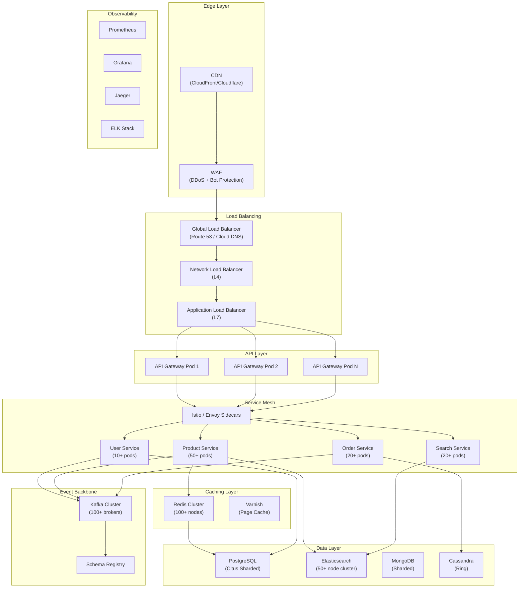

# Ecommerce Microservices — Service Roadmap & Scaling Strategy

---

## Part 1: Current Services (Implemented)

| # | Service | Port | Database | Status | Description |
|---|---|---|---|---|---|
| 1 | **Discovery Service** | 8761 | — | ✅ Production-ready | Netflix Eureka server for service registration & discovery |
| 2 | **API Gateway** | 8080 | — | ✅ Production-ready | Spring Cloud Gateway with path-based routing & load balancing |
| 3 | **User Service** | 8081 | PostgreSQL | 🟡 Partially done | Auth (signup/login/logout), JWT, RBAC. Missing: update, delete, password change |
| 4 | **Product Service** | TBD | MySQL | ✅ Functional | Full CRUD for products & categories, pagination, sorting, nested categories |
| 5 | **Inventory Service** | 8082 | PostgreSQL | 🔴 Scaffold only | App skeleton with DB + JWT configured. No business logic yet |
| 6 | **Notification Service** | 8083 | MongoDB | ✅ Functional | Email sending (simple, attachment, multipart), in-app notifications, Kafka consumer |
| 7 | **Favourite Service** | TBD | MySQL | ✅ Functional | User wishlists with composite key (userId + productId + likeDate) |
| 8 | **Common Library** | — | — | ✅ Functional | Shared JAR: security, exceptions, Kafka CDC, CSV export, audit entities |

---

## Part 2: Planned Services (Ecommerce Domain)

These are services that exist in the parent POM's original module list but have no implementation yet.

| # | Service | Priority | Database | Description |
|---|---|---|---|---|
| 9 | **Order Service** | 🔴 Critical | PostgreSQL | Order lifecycle: create, confirm, cancel, return. Order items, status tracking, order history |
| 10 | **Payment Service** | 🔴 Critical | PostgreSQL | Payment processing, refunds, payment methods, integration with payment gateways (Stripe/Razorpay) |
| 11 | **Shipping Service** | 🟠 High | PostgreSQL | Shipment creation, tracking, carrier integration, delivery status updates |
| 12 | **Rating & Review Service** | 🟡 Medium | MongoDB | Product ratings, text reviews, review moderation, average score calculation |
| 13 | **Search Service** | 🟠 High | Elasticsearch | Full-text product search, faceted filtering, autocomplete, search suggestions |
| 14 | **Promotion Service** | 🟡 Medium | PostgreSQL | Coupons, discount codes, flash sales, bundle deals, loyalty points |
| 15 | **Tax Service** | 🟢 Low | PostgreSQL | Tax calculation by region, GST/VAT rules, tax reporting |
| 16 | **Media Service** | 🟡 Medium | S3/MinIO | Image/video upload, resize, CDN integration, thumbnail generation |

---

## Part 3: All Possible Ecommerce Services (Industry Standard)

A complete ecommerce platform at the scale of Amazon, Flipkart, or Shopify would include these service domains:

### 🛒 Core Commerce

| # | Service | Description |
|---|---|---|
| 17 | **Cart Service** | Shopping cart management, cart persistence, cart expiry, guest cart merging |
| 18 | **Checkout Service** | Checkout orchestrator — coordinates cart, inventory, payment, shipping in a saga |
| 19 | **Pricing Service** | Dynamic pricing, price rules, bulk pricing, currency conversion, price history |
| 20 | **Catalog Service** | Product catalog aggregation, catalog versioning, catalog import/export |
| 21 | **Wishlist Service** | Extended wishlist features — share lists, move to cart, price drop alerts |

### 👤 Customer Domain

| # | Service | Description |
|---|---|---|
| 22 | **Customer Service** | Customer profile management, addresses, preferences (separate from auth) |
| 23 | **Address Service** | Address CRUD, address validation, geocoding, pincode serviceability |
| 24 | **Loyalty/Rewards Service** | Points system, tier management, rewards redemption, cashback |
| 25 | **Subscription Service** | Recurring orders, subscription plans, auto-renewal, subscription boxes |
| 26 | **Referral Service** | Referral codes, referral tracking, reward distribution |

### 📦 Fulfillment & Logistics

| # | Service | Description |
|---|---|---|
| 27 | **Warehouse Service** | Multi-warehouse management, bin locations, stock transfer between warehouses |
| 28 | **Fulfillment Service** | Pick, pack, ship orchestration, fulfillment center assignment |
| 29 | **Return & Refund Service** | Return requests, refund processing, return shipping labels, exchange flow |
| 30 | **Delivery Slot Service** | Time slot management, delivery scheduling, capacity planning |
| 31 | **Last-Mile Tracking Service** | Real-time delivery tracking, driver location, ETA calculation |

### 💰 Financial

| # | Service | Description |
|---|---|---|
| 32 | **Wallet Service** | Digital wallet, balance management, wallet-to-wallet transfer |
| 33 | **Invoice Service** | Invoice generation, PDF export, invoice history, tax invoice compliance |
| 34 | **Settlement Service** | Seller payouts, commission calculation, reconciliation |
| 35 | **Fraud Detection Service** | Transaction risk scoring, anomaly detection, chargeback prevention |

### 🏪 Seller/Vendor Domain

| # | Service | Description |
|---|---|---|
| 36 | **Seller Service** | Seller onboarding, KYC, seller profiles, seller ratings |
| 37 | **Seller Dashboard Service** | Analytics, sales reports, inventory alerts for sellers |
| 38 | **Commission Service** | Commission rules, tiered commissions, marketplace fees |
| 39 | **Seller Catalog Service** | Seller product listings, bulk upload, listing quality checks |

### 📢 Marketing & Engagement

| # | Service | Description |
|---|---|---|
| 40 | **Campaign Service** | Marketing campaigns, A/B testing, targeted promotions |
| 41 | **Recommendation Service** | ML-based product recommendations, "frequently bought together", personalization |
| 42 | **Banner/CMS Service** | Homepage banners, landing pages, content management |
| 43 | **Push Notification Service** | Mobile push, web push, notification preferences |
| 44 | **SMS Service** | OTP delivery, order status SMS, promotional SMS |
| 45 | **Chat/Support Service** | Live chat, chatbot, ticket management, FAQ |

### 📊 Analytics & Intelligence

| # | Service | Description |
|---|---|---|
| 46 | **Analytics Service** | Business metrics, GMV tracking, conversion funnels |
| 47 | **Event Tracking Service** | Clickstream, user behavior, event ingestion pipeline |
| 48 | **Reporting Service** | Scheduled reports, custom dashboards, data export |
| 49 | **Audit Log Service** | Immutable audit trail, compliance logging, change history |

### 🔧 Platform Infrastructure

| # | Service | Description |
|---|---|---|
| 50 | **Config Service** | Centralized configuration (Spring Cloud Config / Consul) |
| 51 | **Feature Flag Service** | Feature toggles, gradual rollouts, canary releases |
| 52 | **Rate Limiter Service** | API rate limiting, throttling, abuse prevention |
| 53 | **File/Document Service** | Document storage, S3 integration, signed URLs |
| 54 | **Scheduler/Cron Service** | Scheduled jobs, retry mechanisms, dead-letter handling |
| 55 | **Geo/Location Service** | Serviceability checks, nearest warehouse, delivery radius |

---

## Part 4: Tools & Technologies for Billion-Scale

To handle **billions of products** and **billions of requests/second**, the following infrastructure is essential:

### 🗄️ Data Layer

| Tool | Category | Why You Need It |
|---|---|---|
| **PostgreSQL** (with Citus) | RDBMS | Distributed PostgreSQL for horizontal sharding of transactional data |
| **MySQL** (with Vitess) | RDBMS | YouTube/Slack-scale MySQL sharding — automatic query routing across thousands of shards |
| **MongoDB** (Sharded Cluster) | NoSQL Document | Auto-sharding for notifications, reviews, event logs at petabyte scale |
| **Apache Cassandra** | NoSQL Wide-Column | 99.99% uptime, linear scalability — ideal for order history, activity feeds, time-series |
| **Redis Cluster** | In-Memory Cache | Sub-millisecond reads, session storage, rate limiting, leaderboards. 1M+ ops/sec per node |
| **Redis Sentinel** | Cache HA | Automatic failover for Redis — zero-downtime cache layer |
| **Apache HBase** | NoSQL Wide-Column | Billion-row tables for product attributes, clickstream storage |
| **Amazon DynamoDB** | Managed NoSQL | Single-digit millisecond at any scale, auto-scaling, on-demand capacity |
| **CockroachDB** | Distributed SQL | Globally distributed SQL with strong consistency — multi-region deployments |

### 🔍 Search & Discovery

| Tool | Category | Why You Need It |
|---|---|---|
| **Elasticsearch** | Search Engine | Full-text search across billions of products, faceted filtering, sub-second response |
| **OpenSearch** | Search Engine | AWS-managed Elasticsearch fork with security & alerting built in |
| **Apache Solr** | Search Engine | Alternative to ES with mature faceting and NRT indexing |
| **Typesense** | Search Engine | Typo-tolerant, blazing fast — good for autocomplete & instant search |
| **Meilisearch** | Search Engine | Developer-friendly instant search, great for smaller-to-mid catalogs |
| **Algolia** | Managed Search | SaaS search-as-a-service, <50ms globally, AI ranking |
| **Vector DB (Pinecone/Weaviate)** | Semantic Search | AI-powered "search by meaning" for recommendations & visual search |

### 📨 Messaging & Event Streaming

| Tool | Category | Why You Need It |
|---|---|---|
| **Apache Kafka** | Event Streaming | Backbone for async communication. Millions of events/sec, exactly-once semantics |
| **Apache Kafka + Schema Registry** | Event Governance | Enforce Avro/Protobuf schemas for all events, prevent breaking changes |
| **Apache Pulsar** | Event Streaming | Multi-tenancy, geo-replication, built-in tiered storage |
| **RabbitMQ** | Message Queue | Lightweight, reliable for task queues (email sending, PDF generation) |
| **Amazon SQS/SNS** | Managed Queue | Fully managed, infinite scale, dead-letter queues, fan-out |
| **NATS** | Lightweight Messaging | Ultra-low latency pub/sub for real-time microservice communication |
| **Debezium** | CDC (Change Data Capture) | Stream database changes to Kafka in real-time — power search indices, caches, analytics |

### 🌐 API & Traffic Management

| Tool | Category | Why You Need It |
|---|---|---|
| **Kong / APISIX** | API Gateway | 100K+ RPS per node, rate limiting, auth, circuit breaking, plugin ecosystem |
| **Envoy Proxy** | Service Mesh Proxy | L7 proxy used by Istio — observability, retries, circuit breaking at the network level |
| **Istio** | Service Mesh | mTLS, traffic shaping, canary deployments, fault injection |
| **Nginx / HAProxy** | Load Balancer | High-performance reverse proxy & load balancing at the edge |
| **Cloudflare / AWS CloudFront** | CDN | Cache static assets globally, DDoS protection, edge computing |
| **GraphQL (Apollo Federation)** | API Layer | Single graph across all microservices, reduce over-fetching for mobile |
| **gRPC** | Inter-Service Protocol | 10x faster than REST for internal service-to-service communication |

### 🏗️ Orchestration & Containerization

| Tool | Category | Why You Need It |
|---|---|---|
| **Kubernetes (K8s)** | Container Orchestration | Auto-scaling, self-healing, rolling deployments, resource limits |
| **Helm** | K8s Package Manager | Templatized deployment manifests, version-controlled releases |
| **ArgoCD** | GitOps CD | Git-based continuous deployment to K8s clusters |
| **Docker** | Containerization | Consistent build artifacts, isolation, reproducible environments |
| **Terraform** | Infrastructure as Code | Provision cloud resources (VPCs, RDS, EKS) declaratively |
| **AWS EKS / GKE / AKS** | Managed K8s | Production-grade managed Kubernetes |

### 📊 Observability (The "Three Pillars")

| Tool | Category | Why You Need It |
|---|---|---|
| **Prometheus** | Metrics | Time-series metrics collection, alerting rules, PromQL |
| **Grafana** | Dashboards | Visualize metrics from Prometheus, Elasticsearch, CloudWatch |
| **Jaeger / Zipkin** | Distributed Tracing | End-to-end request tracing across all microservices |
| **OpenTelemetry** | Telemetry SDK | Vendor-neutral instrumentation — metrics, traces, logs in one SDK |
| **ELK Stack (Elasticsearch + Logstash + Kibana)** | Centralized Logging | Aggregate logs from all services, full-text search on logs |
| **Loki + Grafana** | Lightweight Logging | Cost-effective log aggregation (labels, not full-text indexing) |
| **PagerDuty / OpsGenie** | Incident Management | Alert routing, on-call scheduling, escalation policies |

### 🔐 Security

| Tool | Category | Why You Need It |
|---|---|---|
| **Keycloak** | Identity Provider | OAuth2/OIDC, SSO, social login, user federation, admin console |
| **HashiCorp Vault** | Secrets Management | Encrypt secrets, dynamic credentials, PKI, auto-rotation |
| **Spring Security + OAuth2** | Application Security | Already in use — JWT validation, role-based access |
| **OPA (Open Policy Agent)** | Authorization Policy | Fine-grained, centralized policy enforcement across all services |
| **AWS WAF / Cloudflare WAF** | Web Application Firewall | Block SQL injection, XSS, bot attacks at the edge |
| **SonarQube** | Code Security | SAST — find vulnerabilities in source code during CI |
| **Trivy / Snyk** | Container Security | Scan Docker images for CVEs before deployment |

### ⚡ Performance & Caching

| Tool | Category | Why You Need It |
|---|---|---|
| **Redis** | Application Cache | Cache product pages, user sessions, cart data, rate limits |
| **Memcached** | Distributed Cache | Simple key-value caching at extreme throughput |
| **Hazelcast** | In-Memory Data Grid | Distributed caching + distributed computing |
| **Varnish** | HTTP Cache | Full-page caching at the edge — serve product pages without hitting backend |
| **Apache Spark** | Batch Processing | Process billions of events for analytics, recommendations |
| **Apache Flink** | Stream Processing | Real-time analytics, fraud detection, inventory sync |
| **Read Replicas** | Database | Scale read-heavy queries (product catalog) across multiple DB replicas |

### 🔄 Resilience Patterns

| Pattern | Tool | Why You Need It |
|---|---|---|
| **Circuit Breaker** | Resilience4j / Hystrix | Prevent cascade failures when a downstream service is down |
| **Retry with Backoff** | Spring Retry / Resilience4j | Gracefully handle transient failures |
| **Bulkhead** | Resilience4j | Isolate thread pools so one slow service doesn't exhaust all threads |
| **Rate Limiting** | Bucket4j / Redis | Protect APIs from abuse, enforce fair usage |
| **Saga Pattern** | Axon / Temporal / custom | Distributed transactions across order → payment → inventory |
| **CQRS** | Custom / Axon | Separate read/write models for high-throughput reads (product catalog) |
| **Event Sourcing** | Axon / EventStoreDB | Complete audit trail, temporal queries, event replay |
| **Outbox Pattern** | Debezium + Kafka | Reliable event publishing without dual-write problems |

### 🧪 Testing at Scale

| Tool | Category | Why You Need It |
|---|---|---|
| **JMeter / Gatling** | Load Testing | Simulate millions of concurrent users |
| **k6** | Modern Load Testing | Developer-friendly, scriptable in JS, cloud-native |
| **Locust** | Distributed Load Testing | Python-based, scales to millions of RPS |
| **Testcontainers** | Integration Testing | Spin up real DBs, Kafka, Redis in tests |
| **WireMock** | Service Virtualization | Mock downstream services in tests |
| **Chaos Monkey / LitmusChaos** | Chaos Engineering | Intentionally break things to test resilience |

---

## Part 5: Scaling Architecture Blueprint

### For Billion-Scale Traffic

### Key Scaling Strategies

| Strategy | Target | Approach |
|---|---|---|
| **Horizontal Pod Autoscaling** | All services | Scale pods based on CPU/memory/custom metrics |
| **Database Sharding** | Products, Orders | Shard by productId range or hash, use Vitess/Citus |
| **Read Replicas** | Product Catalog | 10+ read replicas, route reads to replicas |
| **CQRS** | Product reads vs writes | Separate read model (Elasticsearch) from write model (PostgreSQL) |
| **CDN + Edge Caching** | Static assets, product pages | Cache at the edge, TTL-based invalidation |
| **Redis Cluster** | Hot data | Session, cart, rate limits, product cache — 100+ nodes |
| **Kafka Partitioning** | Events | 1000+ partitions per topic, consumer groups for parallel processing |
| **Multi-Region** | Global traffic | Active-active across 3+ regions, CockroachDB for global consistency |
| **Async Everything** | Non-critical paths | Email, notifications, analytics — all async via Kafka |
| **Connection Pooling** | Database | HikariCP with tuned pool sizes, PgBouncer for PostgreSQL |

---

## Part 6: Recommended Implementation Order

### Phase 1 — Core Commerce 
1. ✅ Complete **User Service** (update, delete, change password)
2. ✅ Complete **Inventory Service** (stock CRUD, reserve/release)
3. 🆕 Build **Order Service** (order lifecycle, order items)
4. 🆕 Build **Payment Service** (payment processing, status tracking)

### Phase 2 — Discovery & Search 
5. 🆕 Build **Search Service** (Elasticsearch integration)
6. 🆕 Build **Cart Service** (cart persistence, guest merging)
7. 🆕 Build **Checkout Service** (saga orchestrator)
8. 🔧 Add **Spring Cloud Config** (centralized configuration)

### Phase 3 — Engagement & Logistics 
9. 🆕 Build **Shipping Service** (tracking, carrier integration)
10. 🆕 Build **Rating/Review Service** (MongoDB-based)
11. 🆕 Build **Promotion Service** (coupons, discounts)
12. 🆕 Build **Media Service** (image upload, CDN)

### Phase 4 — Scale & Resilience
13. 🔧 Add **Redis caching** across all read-heavy services
14. 🔧 Add **Resilience4j** circuit breakers
15. 🔧 Add **Prometheus + Grafana** monitoring
16. 🔧 Dockerize all services + **Kubernetes** deployment

### Phase 5 — Intelligence & Advanced
17. 🆕 Build **Recommendation Service** (collaborative filtering)
18. 🆕 Build **Analytics Service** (event tracking pipeline)
19. 🔧 Add **CQRS + Event Sourcing** for order domain
20. 🔧 Add **Keycloak** for centralized identity management
