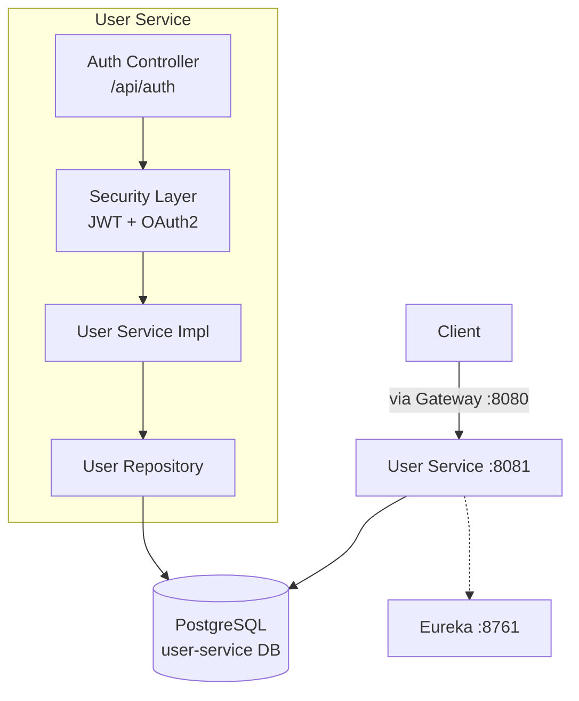
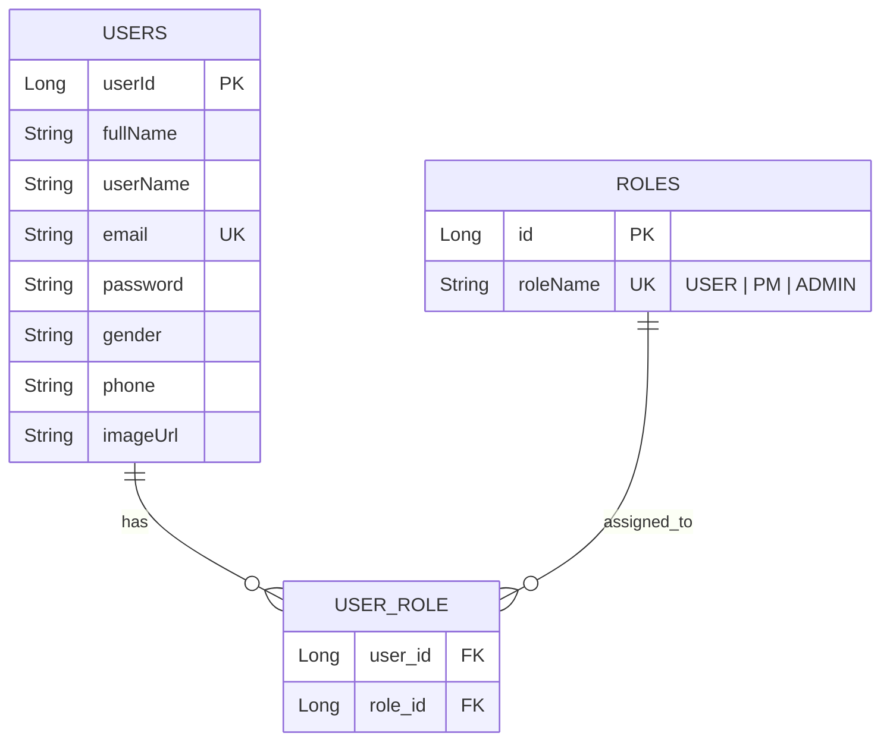
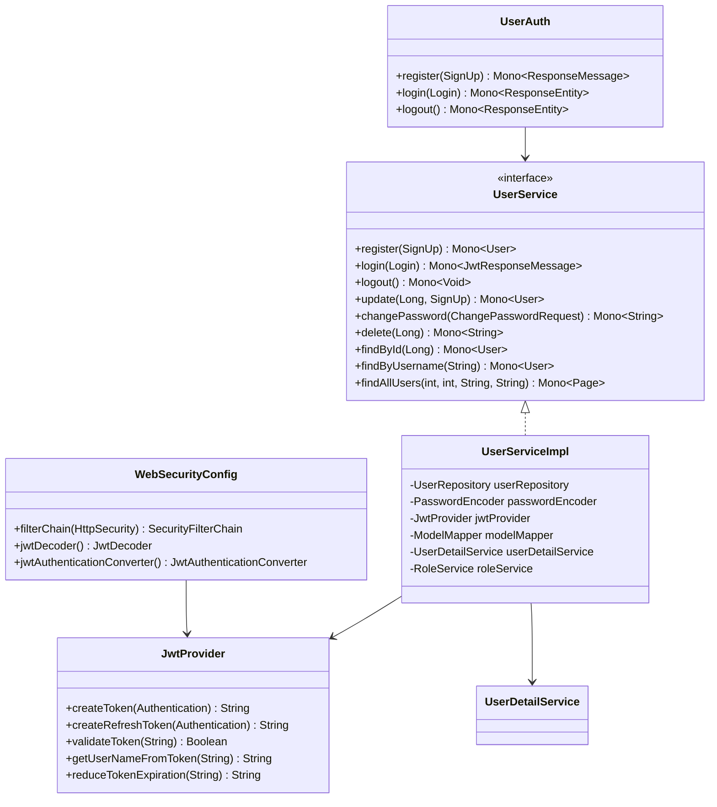
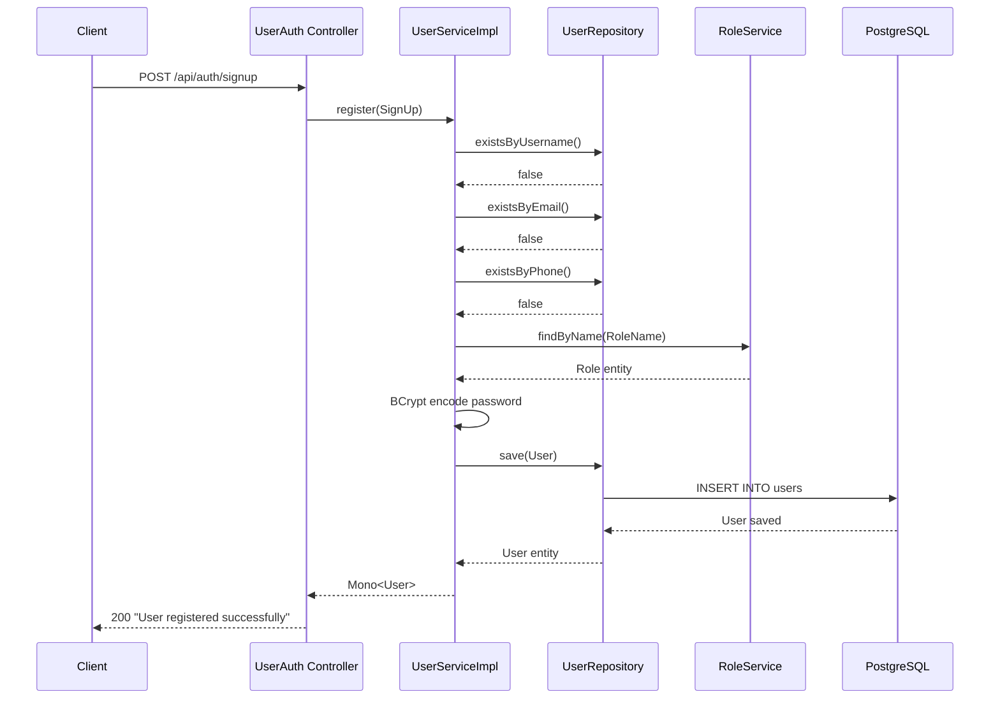
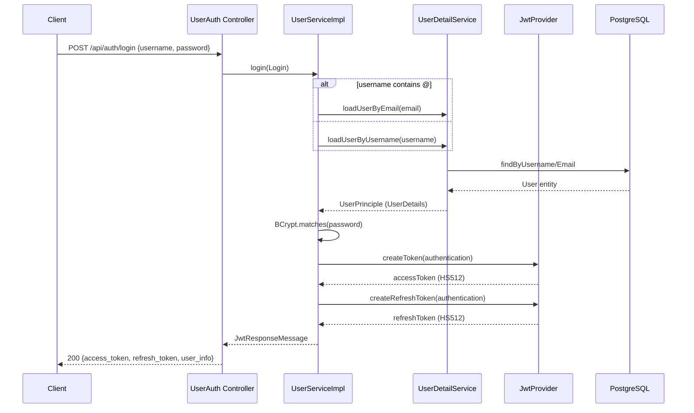

# User Service Documentation

## Overview
The User Service handles **authentication, authorization, and user profile management**. It issues JWT tokens (access + refresh), manages role-based access control (RBAC), and provides user CRUD operations.

**Port:** `8081` &nbsp;|&nbsp; **Database:** PostgreSQL &nbsp;|&nbsp; **Eureka Name:** `USER-SERVICE`

---

## Features

| Feature | Status | Description |
|---|---|---|
| User Registration | ✅ | Sign up with validation (email, phone, password rules) |
| User Login | ✅ | Login via username or email, returns JWT access + refresh tokens |
| User Logout | ✅ | Invalidates JWT by reducing expiration |
| JWT Authentication | ✅ | HS512-signed tokens with configurable expiration |
| OAuth2 Resource Server | ✅ | Validates incoming JWTs via Spring OAuth2 |
| Role Management | ✅ | Assign/revoke roles (USER, PM, ADMIN) |
| Token Validation | ✅ | Validate and extract authorities from JWT |
| Swagger UI | ✅ | OpenAPI docs at `/swagger-ui/index.html` |
| Update User | ⬜ | Stub — not yet implemented |
| Change Password | ⬜ | Stub — not yet implemented |
| Delete User | ⬜ | Stub — not yet implemented |
| Find Users (Paged) | ⬜ | Stub — not yet implemented |

---

## High-Level Design

---

## Low-Level Design

### Entity Relationship

### Class Diagram

### Security Configuration
- **Public endpoints:** `/api/auth/**`, `/api/manager/user/**`, `/v3/api-docs/**`, `/swagger-ui/**`, `/actuator/**`
- **Authenticated endpoints:** `/api/manager/change-password`, `/api/manager/delete/**`, `/api/auth/logout`
- **Session policy:** `STATELESS` (no server-side sessions)
- **JWT Algorithm:** `HS512` with configurable secret key
- **Token expiration:** Access = 24h (86400s), Refresh = 48h (172800s)

---

## Flows

### Flow: User Registration

### Flow: User Login

